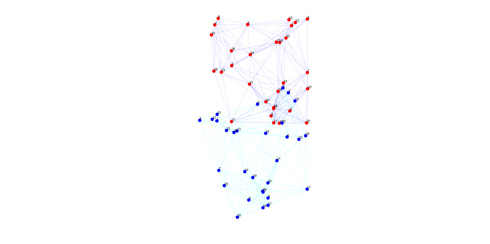
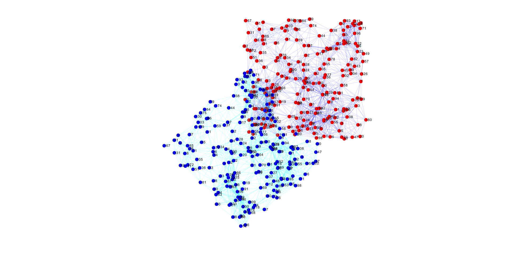

# Anchor-Free Distributed-Localization? Really?

Fooling around with the concept of distributed localization using a simple example.
This is an implementation of the following paper:

>Priyantha, N. B., Balakrishnan, H., Demaine, E., & Teller, S. (2003).
[**Anchor-Free Distributed Localization in Sensor Networks**](http://cricket.csail.mit.edu/papers/TechReport892.pdf).
MIT Laboratory for Computer Science, Technical Report #892, April 15, 2003.

What I actually care is the concept of distributed localization alogorithms and how they work.

There is a **myth** that it is possible to localize a sensor node using only the relative distances information of the nodes to their neighbors.
This is not true. The localization problem is an ill-posed problem, and it is impossible to localize a node using only the relative distances information of the nodes to their neighbors.

As a matter of a fact, after I read papers that claim to solve the localization problem without any anchor nodes, I realized that they are not solving the global localization problem.

If the proposed algorithm(which is mostly a **distributed optimization/root finding algo.**) is numerically stable and converges to a global minima, we will get the actual structure of the network. Here, Although the structure is shaped, it can be rotated, translated, and even reflected.

To solve the issue of the global localization problem, we need to have at least 2 anchor nodes for 2D space, and 3 for 3D.

It's good to notice that if we have other unknown for each node, e.g. timer synchronization bias as in GPS, we would need more anchor nodes. In this case 1 more unknown for each node, leads for a need of 1 more anchor node as if we are solving the problem in a higher dimension.

In the "Images" folder, you can find the results of the algorithm for different test cases.
